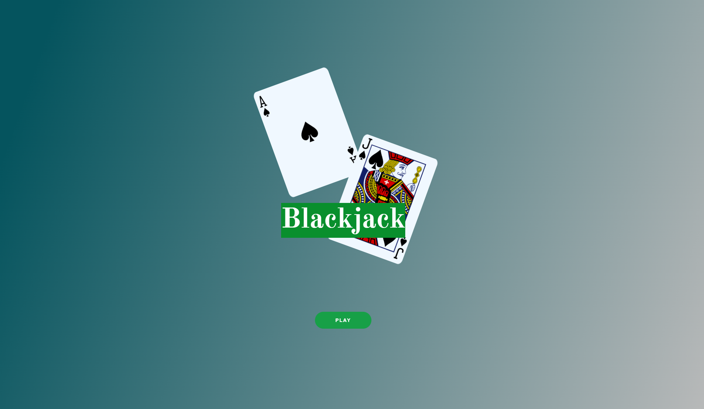
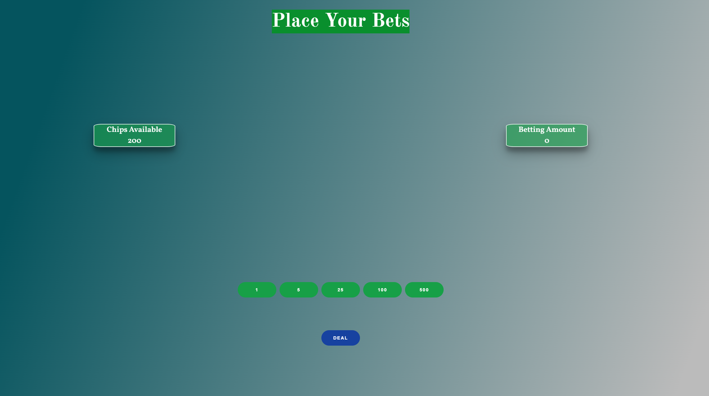
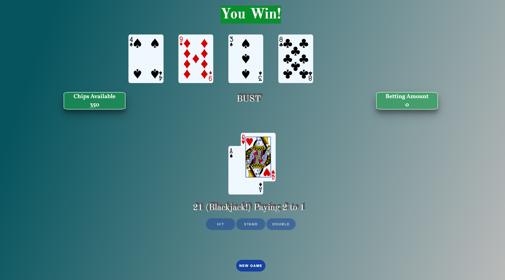
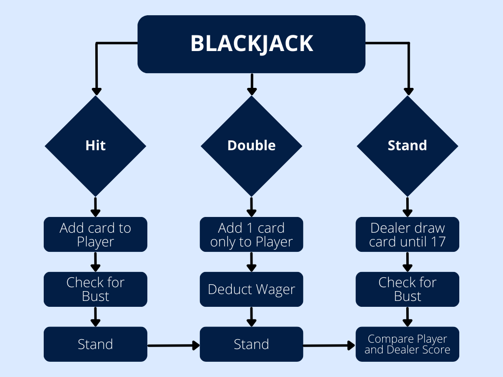
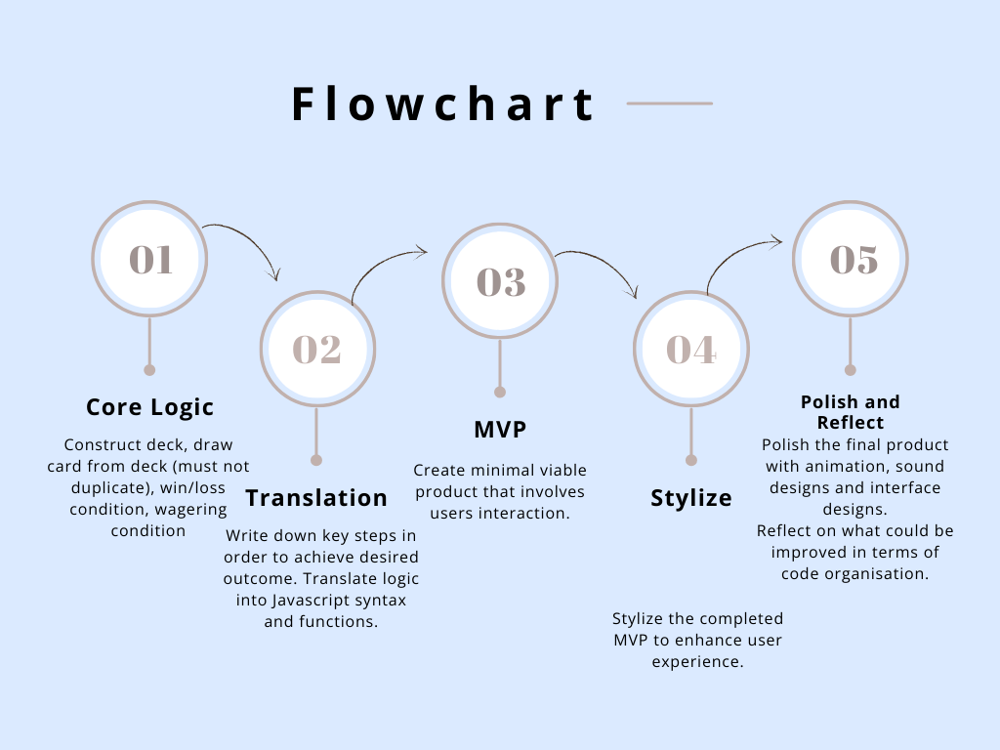
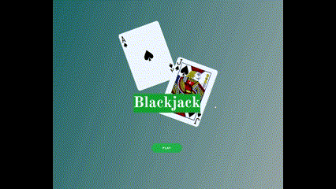
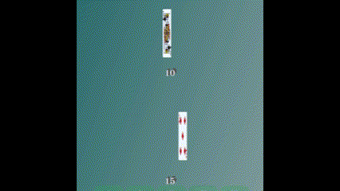

# Classic Blackjack - project1
Thank you for checking out my Blackjack project! :black_joker: I incorporated many new techniques I learnt into this game, try a hand and have fun! :sparkles:
## [Click here](https://cdc998.github.io/project1-Blackjack/) :computer_mouse: to see my live project!
## About :open_book:
- Click the link above to check out my Blackjack game. The game is intuitive and straightforward, follows the classic blackjack rules. Commencing the game, wagering, decision making are all executed through button clicks. :arrow_forward:
- To download my game from GitHub:
```
git clone https://github.com/cdc998/project1-Blackjack.git
cd project1-Blackjack
```
- Navigate to the project1-Blackjack folder, and open index.html with your preferred browser. :computer:

In-game screenshots :framed_picture:




## Planning and Problem Solving :bookmark_tabs:
- For my Blackjack game, I initially focused on the core logic, such as constructing a deck, randomly drawing cards, and establishing win/loss conditions. 	:pencil2:
I tackled this by outlining the steps in plain English, then translating them into JavaScript syntax, ensuring that game logic and decision-making were modularized into functions for easier readability and future updates. 	:abacus:
Once the minimal viable product was working, with basic user interactions in place, I concentrated on adding visual elements and animations. Handling specific challenges like the dual value of aces required special attention to ensure smooth gameplay. Throughout development, I continuously revisited the code to simplify and reduce redundancy, keeping the DRY principle in mind. :bulb:

Flowcharts :chart_with_upwards_trend:



## Sick Tech :moneybag:

- Whilst styling my game from MVP to the final product, I have learnt a considerable amount of how animation works using CSS keyframes, as well as CSS function hover, to create stunning effects when user hovers certain elements. :sparkler:
- Being able to have access to a playing card library definitely helped the game look a lot more polished than it was.
- Learning to add audio files depending on the game outcome was also very fun in progress. :smile:

In-game animations :movie_camera:




## Bugs to fix :cockroach:
- I can quite confidently say that all bugs that I have found while repeatedly losing blackjack hands have been solved. There are no game-breaking bugs or display errors that I can find anymore.
- Mashing buttons doesn't break any code either as I hard coded pointer events to none to many of the animation keyframes. :thumbsup:

## Lessons learnt :sweat_smile:
- Instead of grabbing the HTML element and updating it everytime, I've learnt that storing the value of whatever you want to update into a variable, and then creating a function to render the HTML element only at the end of the block of code you're executing, is much more efficient. :hourglass:
- Spending more time in the early stages of coding planning, will really allow you to put down directionality, and avoid codes that violate DRY. :speaking_head:

## Future Features :lantern:
- I would definitely love to incorproate splitting as a decision that users can choose. The logic behind it was definitely achievable, but to incorporate visual elements on top of that was too challenging for this time. :flower_playing_cards:	:flower_playing_cards:	
- There are also insurance that players can take when dealer's first card is an Ace, would be a fun challenge to add the logic of that into my code as well. :money_with_wings:
- Allowing users to switch between different variations of blackjack is also exciting to think about. :mag_right: